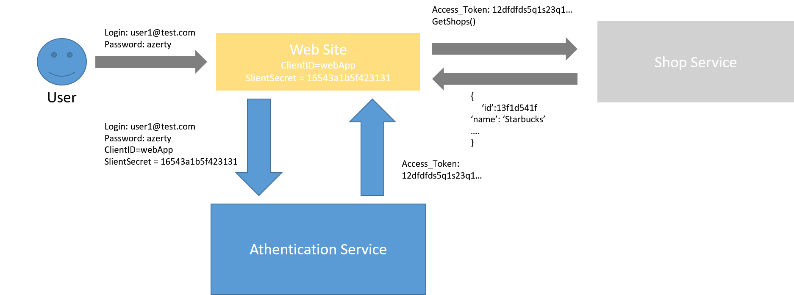
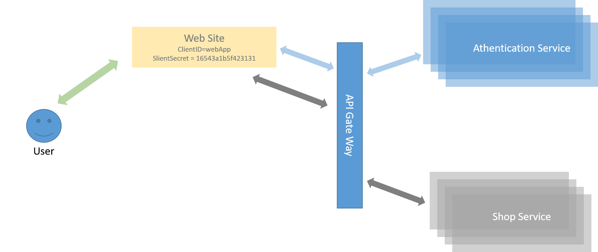

# [NearShops](../README.md)
## Authentication service
Since we have to handle users access to resources and Sessions are **"the evil"**, i've opted for the use of an 
OAuth2-like Tokens on JWT (JSON Web Token). any client have to sign in with the Auth service get a token and use it 
to get resources from the other services. 

Even if it's not said i think it's logical to have regular users and admin users, so for the Auth service, users have
roles (regular or admin) and each service (client) has a (clientID/clientSecret).

How the authentication is done is logicaly like this : <br/>
PS: I'm awful at making figure!<br>


But in reality it looks more like this:<br/>


## Authentication Service REST operations
Following are the REST operations available to use Authentication Service.

|Operation|	HTTP action|Description|
|-------------------------------------------------------------------------|------------------------|--------------------------------------------------------|
|Gives the list of users (requires admin authentication)                  |GET /auth/signin.       |HTTP Code: 200 on success.<br/>Output: JSON users list. |
|Sign in a user by a client.                                              |POST /auth/signin       |HTTP Code: 200 on success.<br>Input: JWT Token.         |
|Signup new user                                                          |POST /auth/signup       |HTTP Code: 201 on success.<br/>Output: JSON added user. |
|update user                                                              |PUT /auth/signup        |HTTP Code: 201 on success.<br/>Input: JSON updated user.|
|delete user (requires admin authentication)                              |DELETE /auth/signup     |HTTP Code: 204 on success                               |

## User Format
Here is a sample of how a user document looks like:
```json
{
    "_id": "5b37a3d2c24feb54f92358f3",
    "login": "user1",
    "password": "bestPassword",
    "role": "regular"
}
```

## Client Format
Here is a sample of how a client document looks like:
```json
{
    "_id": "5b37a3d2c24feb54f92358f3",
    "clientID": "middleware1",
    "password": "1sfg135df1d32fsdf489d7q6sdq6s4d"
}
```